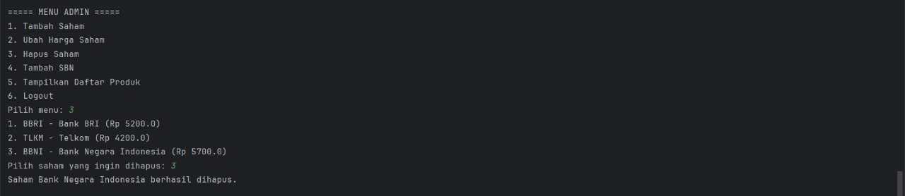

## Nama Kelompok
### Dhani Satriawan (2405551129)
### Tyo Putra Kharinata (2405551162)

---

## UML

@startuml

class Main {
- akun: String[][]
- dataPortofolio: HashMap<String, Portofolio>
- scanner: Scanner
+ main(args: String[]): void
+ login(): void
+ menuAdmin(): void
+ menuCustomer(username: String): void
+ tambahSaham(): void
+ ubahHargaSaham(): void
+ hapusSaham(): void
+ tambahSBN(): void
+ tampilkanProduk(): void
+ beliSaham(p: Portofolio): void
+ jualSaham(p: Portofolio): void
+ beliSBN(p: Portofolio): void
  }

class DataStore {
+ daftarSaham: ArrayList<Saham>
+ daftarSBN: ArrayList<SuratBerhargaNegara>
+ tambahDataDummy(): void
  }

class Saham {
- kode: String
- namaPerusahaan: String
- harga: double
+ getKode(): String
+ getNamaPerusahaan(): String
+ getHarga(): double
+ setHarga(harga: double): void
+ toString(): String
  }

class SuratBerhargaNegara {
- nama: String
- bunga: double
- jangkaWaktu: int
- tanggalJatuhTempo: String
- kuotaNasional: double
+ getNama(): String
+ getBunga(): double
+ getJangkaWaktu(): int
+ getTanggalJatuhTempo(): String
+ getKuotaNasional(): double
+ kurangiKuota(jumlah: double): void
+ toString(): String
  }

class Portofolio {
- sahamDimiliki: HashMap<Saham, Integer>
- sbnDimiliki: HashMap<SuratBerhargaNegara, Double>
+ beliSaham(saham: Saham, jumlah: int): void
+ jualSaham(saham: Saham, jumlah: int): boolean
+ beliSBN(sbn: SuratBerhargaNegara, nominal: double): void
+ tampilkan(): void
+ simulasiSBN(): void
  }

Main --> DataStore
Main --> Saham
Main --> SuratBerhargaNegara
Main --> Portofolio
DataStore --> Saham
DataStore --> SuratBerhargaNegara
Portofolio "1" o-- "*" Saham
Portofolio "1" o-- "*" SuratBerhargaNegara

@enduml

---

### Diagram UML

---

## Skenario Program: Simulasi Investasi Saham & SBN

Berikut ini adalah skenario lengkap program berbasis terminal yang mensimulasikan proses login, pembelian/penjualan saham, pembelian dan simulasi SBN, hingga logout dan keluar dari program.

---
## User
### Step 1: Login

Setelah program dijalankan, pengguna akan melihat menu utama dengan dua pilihan: Login dan Keluar.  
Pengguna memilih menu 1 (Login), lalu diminta memasukkan username dan password.  
Pada contoh ini, pengguna memasukkan username `user1` dan password `user123`.

---

### Step 2: Beli Saham

Setelah login, pengguna masuk ke Menu Customer dan memilih opsi 1 (Beli Saham).  
Program kemudian menampilkan daftar saham yang tersedia, seperti BBRI dan TLKM, lengkap dengan harga per lembar.  
Pengguna memilih saham BBRI dan memasukkan jumlah pembelian sebanyak 500 lembar.  
Program menampilkan pesan bahwa pembelian berhasil.

---

### Step 3: Jual Saham

Dari Menu Customer, pengguna memilih opsi 2 (Jual Saham).  
Program menampilkan daftar saham yang dimiliki, dalam contoh ini adalah BBRI dengan jumlah 500 lembar.  
Pengguna memilih saham BBRI dan memasukkan jumlah penjualan sebanyak 500 lembar.  
Program kemudian mengonfirmasi bahwa penjualan berhasil.

---

### Step 4: Beli SBN

Di Menu Customer, pengguna memilih opsi 3 (Beli SBN).  
Program menampilkan daftar produk SBN (Surat Berharga Negara) yang tersedia, seperti SBR012 dan ORI021, beserta detail bunga, tempo, dan kuota.  
Pengguna memilih SBR012 dan memasukkan nominal pembelian sebesar Rp 5.000.000.  
Program kemudian menampilkan pesan bahwa pembelian SBN berhasil.

---

### Step 5: Simulasi SBN

Pada Menu Customer, pengguna memilih opsi 4 (Simulasi SBN).  
Program meminta pengguna memasukkan nominal investasi untuk setiap produk SBN, seperti SBR012 dan ORI021.  
Setelah input nominal Rp 5.000.000 untuk kedua produk, program menghitung dan menampilkan estimasi bunga bulanan yang diperoleh, yaitu Rp 24.375,00 untuk SBR012 dan Rp 23.437,50 untuk ORI021.

---

### Step 6: Portofolio

Pengguna memilih opsi 5 (Portofolio) dari Menu Customer.  
Program kemudian menampilkan semua aset investasi yang dimiliki, baik saham maupun SBN.  
Dalam kasus ini, hanya investasi di SBR012 yang tercatat, dengan nilai Rp 5.000.000,00 dan estimasi bunga bulanan Rp 24.375,00.

---

### Step 7: Logout

Pengguna memilih opsi 6 (Logout) dari Menu Customer.  
Program kemudian mengarahkan pengguna kembali ke Menu Utama, di mana tersedia pilihan Login untuk masuk kembali atau Keluar untuk menutup program.

---

### Step 8: Keluar

Setelah logout dan kembali ke Menu Utama, pengguna memilih opsi 2 (Keluar).  
Program kemudian menampilkan pesan _"Program selesai. Terima kasih!"_ dan proses program diakhiri dengan exit code 0, yang menandakan bahwa program telah berhenti dengan normal tanpa error.

---

## Admin
### Step 1: Login

Pada tahap ini, program menampilkan MENU UTAMA, dan pengguna memilih opsi Login. Dengan memasukkan username admin dan password admin123, pengguna berhasil masuk sebagai admin. Program kemudian menampilkan MENU ADMIN yang berisi opsi untuk menambah, mengubah, menghapus saham, menambah SBN, menampilkan daftar produk, dan logout.

---

### Step 2: Tambah Saham

Pada tahap ini, setelah masuk ke MENU ADMIN, pengguna memilih opsi 1. Tambah Saham. Program meminta input berupa kode saham (BBNI), nama perusahaan (Bank Negara Indonesia), dan harga saham (6500). Setelah data diisi, program menampilkan pesan konfirmasi bahwa saham berhasil ditambahkan ke daftar investasi.

---

### Step 3: Ubah Harga Saham

Pada tahap ini, pada MENU ADMIN, pengguna memilih opsi 2. Ubah Harga Saham. Program menampilkan daftar saham yang tersedia, kemudian pengguna memilih saham BBNI - Bank Negara Indonesia. Setelah memasukkan harga baru (5700), program menampilkan konfirmasi bahwa harga saham berhasil diubah.

---

### Step 4: Hapus Saham

Pada tahap ini, pada MENU ADMIN, pengguna memilih opsi 3. Hapus Saham. Program menampilkan daftar saham yang tersedia, lalu pengguna memilih saham BBNI - Bank Negara Indonesia untuk dihapus. Setelah dipilih, program mengonfirmasi bahwa saham tersebut berhasil dihapus dari daftar.

---

### Step 5: Tambah SBN

Pada tahap ini, pada MENU ADMIN, pengguna memilih opsi 4. Tambah SBN. Program meminta input data SBN, yaitu nama (SR017), bunga (5.9), jangka waktu (36 bulan), tanggal jatuh tempo (12-05-2028), dan kuota nasional (5000000000). Setelah semua data diisi, program menampilkan konfirmasi bahwa SBN berhasil ditambahkan ke daftar.

---

### Step 6: Tampilkan Daftar Produk

Pada tahap ini, di MENU ADMIN, pengguna memilih opsi 5. Tampilkan Daftar Produk. Program menampilkan seluruh daftar saham dan SBN yang tersedia, lengkap dengan informasi kode, nama, harga untuk saham, serta bunga, tanggal jatuh tempo, dan kuota nasional untuk SBN.

---

### Step 7: Logout

Pada tahap ini pengguna memilih opsi 6 (Logout) dari Menu Admin.
Program kemudian mengarahkan admin kembali ke Menu Utama, di mana tersedia pilihan Login untuk masuk kembali atau Keluar untuk menutup program.

---

### Step 8: Keluar

Pada tahap ini di menu Admin, pengguna memilih opsi 2 (keluar)
Program kemudian menampilkan pesan "Program selesai. Terima kasih!" dan proses program diakhiri dengan exit code 0, yang menandakan bahwa program telah berhenti dengan normal tanpa error.

---